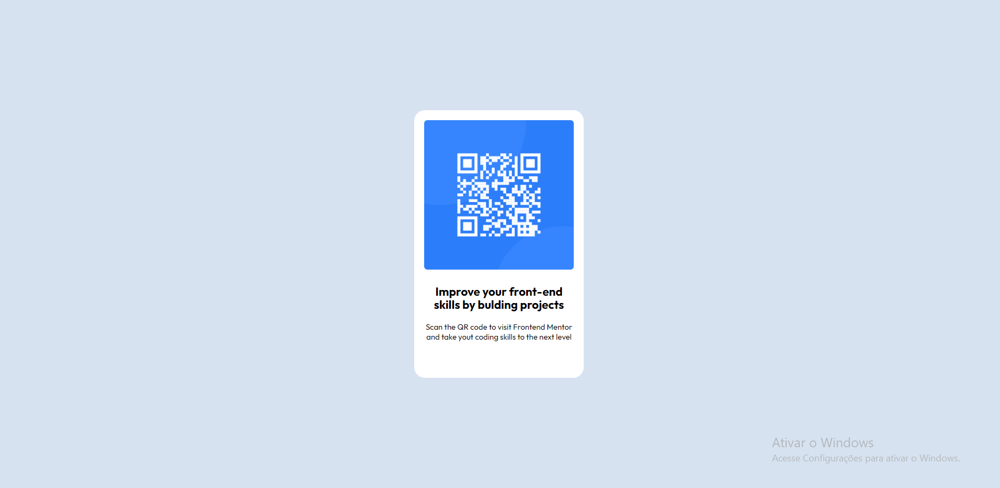
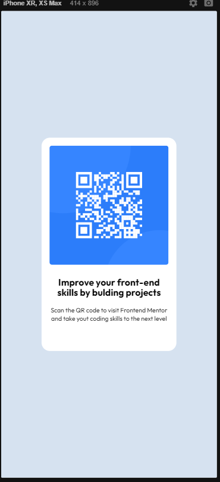

# Projeto Qr-Code component

### Sobre:
Este é um projeto desenvolvido apartir do desafio do site FrontEnd Mentor com o meso nome:

https://www.frontendmentor.io/challenges/qr-code-component-iux_sIO_H

Este projeto foi feito para estudo próprio, com aprendizagem da propriedade em CSS: FLEXBOX 

## Imagens do projetos
Versão Desktop:

Versão Mobile:
 

## Tecnologias usadas nesse projeto
- Html
- Css